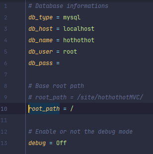
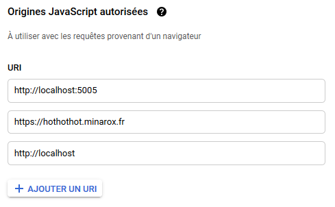
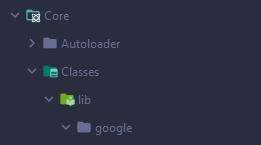

# `hothothot` - https://hothothot.minarox.fr/

## Listes des étapes à suivre :

---

- Récupérer la base de données !

---

- Le fichier config.ini se présente maintenant de la façon suivante (La variable `root_path` correspond au placement du site sur le serveur que tu utilises, `/` étant la racine du serveur) :

---

- Faire fonctionner la fonction `mail()` de PHP en local sous wamp :

    https://grafikart.fr/blog/mail-local-wamp

---

- Télécharger Google lib

URL autorisées pour l'authentification avec Google (Vous ne pouvez faire marcher la connexion Google sur votre Vhost s'il n'est pas en HTTPS ou qu'il ne se finisse pas par une extension de domaine publique de premier niveau telle que : `.com` `.fr` ) :

Créer une arborescence de cette façon :

Puis y faire la commande suivante dans le dossier 'google' que tu as créé (cela peut prendre un certain temps ...) :
    
    composer require google/apiclient