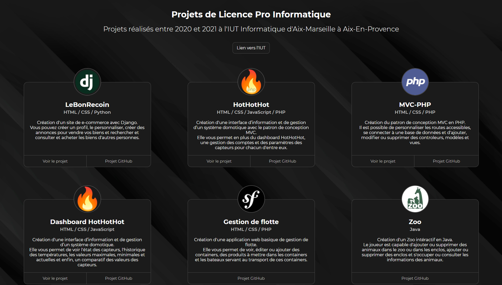

# Hothothot
Création d'une interface d’information et de gestion d’un système domotique.

   
[Démo du site](https://lp-dev-web.github.io/Dashboard-HotHotHot/)

## Fonctionnalités
* Gestion de multiples capteurs
* Graphique des températures sur plusieurs heures
* Température maximale, minimale et moyenne
* Graphique de comparaison des températures des capteurs

## Languages
* HTML
* CSS
* JavaScript
* JSON

## Dépendances
* [ChartJS](https://www.chartjs.org/)
* [Jquery](https://jquery.com/)
